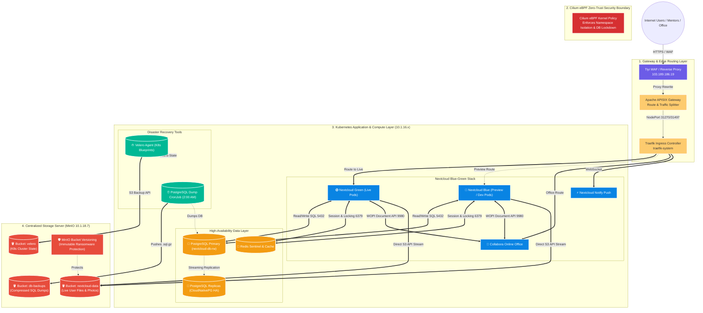

# Master Enterprise Infrastructure & Security Architecture

This document provides the complete, end-to-end architectural blueprint for the Nextcloud Enterprise Private Cloud, integrating Edge Gateways, Ingress Routing, eBPF Zero-Trust Security, High-Availability Data Stores, Object Storage, and Disaster Recovery.

---

## 1. Complete System Architecture Diagram

---

## 2. Architectural Layer Breakdown

### Layer 1: Edge WAF & Gateways
* **Tiyi WAF (`103.189.186.19`):** Terminates external SSL certificates, mitigates DDoS attacks, and inspects HTTP traffic.
* **Apache APISIX:** Handles advanced traffic routing, proxy-rewriting (`^/nextcloud/(.*)` ➡️ `/${1}`), OIDC SSO integration, and Blue-Green traffic switching.
* **Traefik Ingress Controller:** Runs on Kubernetes nodes, providing internal load balancing and TLS pass-through.

### Layer 2: Cilium & Tetragon eBPF Zero-Trust Security Suite
* **Cilium eBPF Network Policies:** Enforces kernel-level packet filtering and namespace isolation.
  * **Cross-Namespace Deny:** Unauthorized namespaces (`default`, `dev`, `test`) cannot reach internal databases or pods.
  * **PostgreSQL Lockdown:** Only authorized Nextcloud pods and replication instances can establish connections to port `5432`.
* **Tetragon eBPF Runtime Security:** Operates directly inside the Linux kernel to intercept syscalls (`execve`, `openat`).
  * **Process Observability:** Real-time tracking of all binary executions and command arguments inside containers.
  * **Webshell & Exploit Prevention:** Real-time kernel intervention (`Sigkill`) against unauthorized shells or privilege escalation attempts.

### Layer 3: Application Compute & Blue-Green Releases
* **Nextcloud Blue-Green:** Two independent deployments (`nextcloud-green` and `nextcloud-blue`) alternate roles between **Live** and **Dev/Testing**, guaranteeing zero-downtime releases and instant rollbacks.
* **Collabora Online:** High-performance document editing cluster communicating via WOPI protocol.
* **Notify-Push:** High-speed WebSocket server for instantaneous client synchronization.

### Layer 4: High-Availability State Layer
* **CloudNativePG (PostgreSQL 15):** 3-node HA cluster with automated failover and synchronous replication.
* **Redis Sentinel:** Multi-node in-memory cluster handling PHP session persistence, file locking, and pub/sub caching.

### Layer 5: Object Storage & 3-Tier Disaster Recovery
* **MinIO Object Storage (`10.1.18.7:9000`):** Centralized S3 storage hosting all file assets.
* **Tier 1 (Infrastructure):** VMware Tanzu Velero snapshots Kubernetes YAML blueprints to the `velero` bucket.
* **Tier 2 (Database):** Automated Kubernetes CronJob dumps PostgreSQL every night at 2:00 AM to the `db-backups` bucket.
* **Tier 3 (User Files):** MinIO Bucket Versioning retains immutable history of modified/deleted files for instant rollback against ransomware.

---

## 3. Disaster Recovery Matrix

| Failure Scenario | Recovery Tool | Recovery Time Objective (RTO) |
| :--- | :--- | :--- |
| **Accidental Namespace Deletion** | `velero restore create --from-backup ...` | < 60 seconds |
| **Database Corruption / Data Loss** | Restore `.sql.gz` dump from `db-backups` | < 5 minutes |
| **Accidental File Deletion / Ransomware** | MinIO Bucket Versioning Rollback | < 1 minute |
| **Bad Application Release / Code Bug** | APISIX Instant Blue-Green Switchback | < 1 second |
