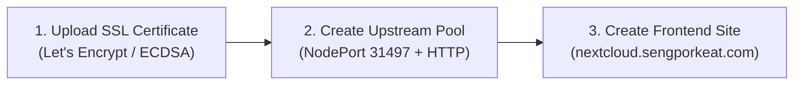

# 2. Tiyi WAF & Reverse Proxy Configuration Guide

In Tiyi WAF, configuration must follow a specific 3-step order: **Certificate &rarr; Upstream Pool &rarr; Site**.

---

## Step 1: Upload SSL Certificate (TLS Certificates Menu)

Before creating the site, upload the generated Let's Encrypt certificates:

1. In Tiyi WAF, navigate to **Certificates / SSL** &rarr; **Add Certificate**.
2. **Name:** `nextcloud-letsencrypt`
3. **Certificate (`fullchain.pem`):** Paste the certificate content (or Certificate + Chain blocks).
4. **Private Key (`privkey.pem`):** Paste the private key content.
5. Click **Save / Upload**.

---

## Step 2: Create Upstream Pool (Backend Targets)

1. Navigate to **Upstream Pools** &rarr; **Create Pool**.
2. **Pool Name:** `nextcloud-cluster-pool`
3. **Load Balancing Algorithm:** `Round Robin` or `IP Hash`
4. **Add Backend Endpoints:**
   * `http://10.1.16.11:31497` (Weight: 100)
   * `http://10.1.16.12:31497` (Weight: 100)
   * `http://10.1.16.13:31497` (Weight: 100)
5. **Backend Protocol:** **`HTTP`** *(SSL Termination mode — avoids internal self-signed TLS validation drops)*.
6. **Health Check:** `Passive Only` *(Nextcloud returns 302 login redirects, which active probes mark as down)*.
7. Click **Save Pool**.

---

## Step 3: Create Frontend Site (Public Domain Ingress)

1. Navigate to **Sites** &rarr; **Create Site**.
2. **Site Name:** `nextcloud`
3. **Primary Host:** `nextcloud.sengporkeat.com`
4. **Backend Source:** Select `Upstream Pool` &rarr; Choose `nextcloud-cluster-pool`.
5. **TLS Mode:** `Uploaded` &rarr; Select `nextcloud-letsencrypt`.
6. **HTTP Behavior:** `Redirect to HTTPS`
7. **TLS Minimum:** `TLS 1.2` or `TLS 1.3`
8. **WAF Protection:** `Enabled` (Active Protection / Inspection).
9. Click **Save Site & Deploy**.
