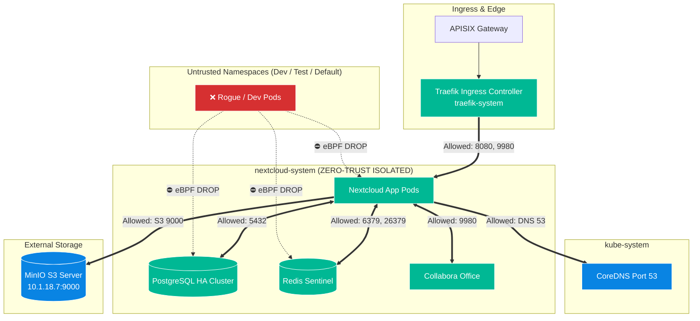

# Cilium eBPF Zero-Trust Namespace Network Isolation

This guide documents the implementation and enforcement of **Zero-Trust Network Isolation** in Kubernetes using **Cilium eBPF**.

## Overview
By default, Kubernetes uses a flat, open network where any pod in any namespace can send traffic to any other pod. To satisfy enterprise security standards, we enforce **eBPF-level kernel isolation** using `CiliumNetworkPolicy` to protect the Nextcloud production stack, PostgreSQL database, and Redis cache from unauthorized cross-namespace lateral movement.

---

## Network Architecture & Isolation Model



---

## Applied Policies

The policies are defined in [`manifests/03-security-cilium/cilium-nextcloud-isolation.yaml`](../manifests/03-security-cilium/cilium-nextcloud-isolation.yaml):

### 1. `nextcloud-system-namespace-isolation`
* **Target:** All pods in `nextcloud-system`.
* **Ingress Rule:** Allows traffic from `traefik-system` (`app.kubernetes.io/name: traefik`) on ports `8080`, `9980`, `7867`, and host/nodeport proxies.
* **Intra-Namespace Rule:** Allows full pod-to-pod communication within `nextcloud-system`.
* **Egress Rule:** Allows outbound traffic to CoreDNS (`kube-system:53`), MinIO (`10.1.18.7:9000`), and external internet/SSO.
* **Deny Rule:** Silently drops all ingress packets originating from other namespaces (`default`, `dev`, `test`).

### 2. `postgresql-database-lockdown`
* **Target:** PostgreSQL pods (`cnpg.io/cluster: nextcloud-db`).
* **Rule:** Restricts port `5432` strictly to Nextcloud application pods, intra-cluster DB replication, and backup CronJobs.

---

## How to Apply

To apply the Cilium policies to the cluster:

```bash
kubectl apply -f manifests/03-security-cilium/cilium-nextcloud-isolation.yaml
```

To verify the active policies:
```bash
kubectl get cnp -n nextcloud-system
```

---

## How to Verify Isolation (Security Probe Test)

To prove that cross-namespace isolation is actively enforced by eBPF:

1. **Spin up a test probe pod in the `default` namespace:**
   ```bash
   kubectl run security-probe --image=curlimages/curl -n default -- sleep 3600
   ```

2. **Attempt to access Nextcloud's PostgreSQL database directly:**
   ```bash
   kubectl exec security-probe -n default -- nc -zv -w 3 nextcloud-db-rw.nextcloud-system.svc.cluster.local 5432
   ```
   * **Result:** `nc: connect to nextcloud-db-rw (5432) timed out` (Packet successfully dropped by eBPF).

3. **Clean up probe:**
   ```bash
   kubectl delete pod security-probe -n default
   ```

---

## Emergency Rollback

If you need to instantly disable all isolation rules and return to the default flat network:

```bash
kubectl delete -f manifests/03-security-cilium/cilium-nextcloud-isolation.yaml
```
*(Takes effect in 0.1 seconds across all nodes with zero downtime).*
