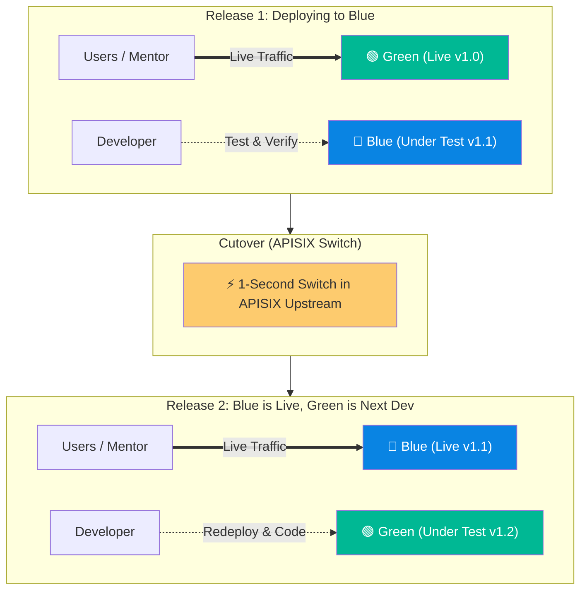

# Nextcloud Blue-Green Zero-Downtime Deployment Strategy

This document details the **Blue-Green Deployment Strategy** customized for the Nextcloud Kubernetes cluster, allowing zero-downtime releases, safe preview testing, and instant rollbacks.

---

## 1. How Blue-Green Works (The "Ping-Pong" Lifecycle)

Instead of modifying the live production pods while users are online, we alternate between two identical deployments: **Green** and **Blue**.



---

## 2. Why Data & Files Stay 100% In Sync

Because Nextcloud pods are **stateless**, all persistent state lives in the shared storage and database layer:

* **Files & Media:** Stored directly in **MinIO S3** (`nextcloud-data` bucket). Both Green and Blue connect to the same bucket.
* **Database & Settings:** Stored in **CloudNativePG PostgreSQL** (`nextcloud-db-rw`). Any app enabled or theme changed on Blue is immediately in PostgreSQL.
* **Sessions & Locking:** Handled by **Redis Sentinel** (`nextcloud-redis`).

👉 **Zero file-copying or data migration is required between pods.** When you switch traffic, users see all their files instantly.

---

## 3. Step-by-Step Implementation Guide

### Step 1: Deploy Blue
Deploy the Blue service and deployment alongside Green:

```bash
kubectl apply -f manifests/11-nextcloud-blue-deployment.yaml
```

### Step 2: Test & Verify on Blue
Access the dedicated preview route in your browser (e.g. `https://blue.sengporkeat.com` or via APISIX header `X-Environment: blue`).

Verify:
1. Custom UI / theme loads properly.
2. Documents open in Collabora Office.
3. Upload / download works with MinIO.

### Step 3: Go Live (The 1-Second Cutover)
Update your APISIX upstream for `nextcloud.sengporkeat.com` to route traffic to `nextcloud-service-blue:8080`:

```bash
# Update APISIX route upstream
curl -X PATCH http://apisix-admin:9180/apisix/admin/routes/nextcloud-service \
  -H "X-API-KEY: edd1c9f034335f136f87ad84b625c8f1" \
  -d '{"upstream": {"nodes": {"nextcloud-service-blue.nextcloud-system.svc.cluster.local:8080": 1}}}'
```
⚡ **All live users now seamlessly use Blue with zero seconds of downtime.**

### Step 4: Sync & Redeploy Green for the Next Sprint
Now that Blue is live, prepare Green for your next batch of features:

* **If updating image tag:**
  ```bash
  kubectl set image deployment/nextcloud-green nextcloud=nextcloud:new-tag -n nextcloud-system
  ```
* **If updating PHP / ConfigMap settings:**
  ```bash
  kubectl rollout restart deployment/nextcloud-green -n nextcloud-system
  ```
* **To save RAM when not developing:**
  ```bash
  kubectl scale deployment/nextcloud-green --replicas=0 -n nextcloud-system
  ```

---

## 4. Instant Rollback Plan
If an unexpected bug occurs on Blue after release:
* Revert the APISIX upstream back to `nextcloud-service-green` in **0.1 seconds**.
* Users are instantly returned to the rock-solid Green version while you debug Blue.
