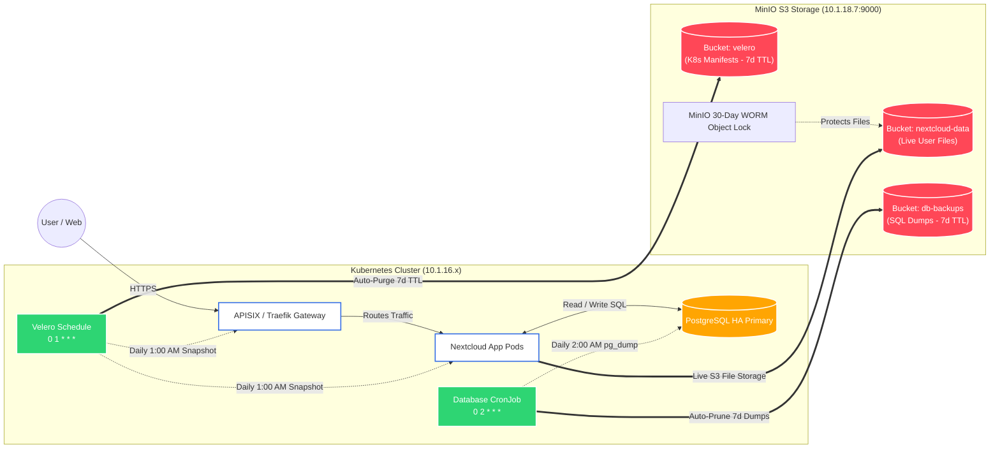

# Enterprise 3-Tier Backup & Disaster Recovery Architecture

This document details the automated backup, disaster recovery, and 7-day rolling retention lifecycle architecture for the Nextcloud Kubernetes cluster. The environment uses a strict **3-Tier Backup Strategy** utilizing MinIO (S3) as the centralized storage backend.

---

## 🏗️ Architecture Blueprint

The visual diagram below outlines how the Kubernetes cluster, Nextcloud application, and backup automation interact with the MinIO S3 server for both **Live Data** and **Scheduled Backup Streams**.



---

## 📋 The 3-Tier Backup Matrix & Retention Lifecycle

| Tier | Tool / Component | Schedule | Scope | Retention (TTL) | RTO / RPO |
| :--- | :--- | :--- | :--- | :--- | :--- |
| **Tier 1** | **Velero S3 Plugin** | `0 1 * * *` (Daily 1:00 AM) | K8s Deployments, Services, Secrets, IngressRoutes | **7 Days** (`ttl: 168h`) | RTO: < 60s<br>RPO: 24h |
| **Tier 2** | **PostgreSQL Backup CronJob** | `0 2 * * *` (Daily 2:00 AM) | Full `nextcloud` database SQL dump | **7 Days** (`mc rm --older-than 7d`) | RTO: < 2m<br>RPO: 24h |
| **Tier 3** | **MinIO Object Lock & Versioning** | Continuous / Real-Time | User photos, documents, shared files | **30 Days WORM** | RTO: Instant<br>RPO: 0s |

---

## 🔍 Detailed Tier Breakdown

### Tier 1: Infrastructure State & Cluster Blueprint (Velero)
* **Target:** `velero` MinIO S3 Bucket
* **Function:** Takes a daily snapshot of the Kubernetes cluster's entire state (`nextcloud-system`, `traefik-system`, `metallb-system`).
* **Auto-Purge Lifecycle:** Configured with `ttl: 168h0m0s`. Velero automatically deletes snapshots older than **7 days** directly from MinIO, preventing storage exhaustion.
* **Disaster Recovery:** If an entire namespace is deleted, `velero restore create --from-backup <backup-name>` rebuilds all secrets, deployments, and network policies in seconds.

### Tier 2: Relational Database Consistency (CronJob)
* **Target:** `db-backups` MinIO S3 Bucket
* **Function:** Dumps active PostgreSQL database memory (`pg_dump`) via `postgres:16-alpine`, compresses the stream with `gzip`, and uploads to MinIO.
* **Auto-Purge Lifecycle:** Executes `/tmp/mc rm --recursive --force --older-than 7d myminio/db-backups/` after each successful upload.
* **Disaster Recovery:** Databases can be recovered by streaming the dump directly back into PostgreSQL:
  ```bash
  gunzip -c backup.sql.gz | kubectl exec -i -n nextcloud-system nextcloud-db-1 -- psql -U admin -d nextcloud
  ```

### Tier 3: Immutable User Storage (MinIO Versioning & Object Lock)
* **Target:** `nextcloud-data` MinIO S3 Bucket
* **Function:** Nextcloud stores all user files directly on S3. MinIO enforces cryptographic object versioning and WORM (Write Once, Read Many) retention.
* **Disaster Recovery:** If ransomware or an accidental user action attempts to delete/modify a file, MinIO retains previous versions for 30 days, allowing instant single-file recovery.

---

## 🚨 Disaster Recovery (DR) Metrics

* **RPO (Recovery Point Objective):** Maximum data loss window is **24 hours** (or 0 hours for user files in MinIO).
* **RTO (Recovery Time Objective):** Total cluster and database restore time is **under 3 minutes**.
