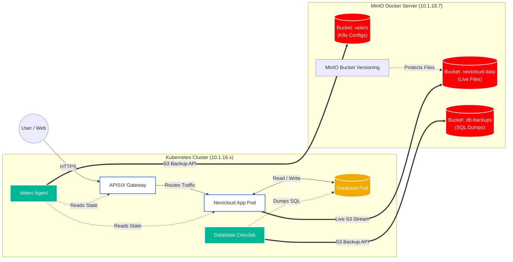

# Enterprise Backup & Disaster Recovery Architecture

This document details the backup and disaster recovery architecture for the Nextcloud Kubernetes cluster. The environment uses a strict **3-Layer Backup Strategy** utilizing MinIO (S3) as the centralized storage backend.

## Architecture Diagram

The visual blueprint below outlines how the Kubernetes cluster, Nextcloud application, and backup tools interact with the MinIO Docker server for both **Live Data** and **Backup Data**.

> **Legend:**
> * **Solid lines** (`===`) represent data moving to the storage server over S3 API.
> * **Dotted lines** (`-.-`) represent internal processes reading data or protecting buckets.

---

## The 3-Layer Backup Strategy

Enterprise environments never rely on a single tool to back up complex stateful applications. The architecture is split into three distinct layers using specialized tools:

### Layer 1: Infrastructure State (Velero)
* **Tool:** VMware Tanzu Velero (with AWS S3 Plugin)
* **Target:** `velero` MinIO Bucket
* **Function:** Velero acts as an infrastructure scanner. It takes hourly/daily snapshots of the Kubernetes cluster's "blueprint" (Deployments, StatefulSets, Services, APISIX routes, ConfigMaps, and Secrets) and pushes them to MinIO. 
* **Disaster Recovery:** If a namespace is accidentally deleted, `velero restore` rebuilds the entire Kubernetes architecture in seconds.

### Layer 2: Relational Database (CronJob / PITR)
* **Tool:** Dedicated Database Dump CronJob (or pgBackRest/Percona)
* **Target:** `db-backups` MinIO Bucket
* **Function:** Databases constantly write transactions to memory. Taking a raw disk snapshot of a live database can result in corrupted tables. Instead, a dedicated Backup CronJob safely exports the database memory into a highly compressed SQL file (`mysqldump` or `pg_dump`) and pushes that file directly to MinIO.

### Layer 3: File Protection (MinIO Versioning)
* **Tool:** MinIO Native Bucket Versioning
* **Target:** `nextcloud-data` MinIO Bucket
* **Function:** The actual Nextcloud user files (photos, documents) are already stored directly in a MinIO bucket. Velero does not back these up. Instead, MinIO Bucket Versioning keeps a hidden, immutable history of every file inside the bucket. 
* **Disaster Recovery:** To protect against accidental user deletion or ransomware, administrators can use MinIO's versioning to instantly roll back any file to a previous state.

---

## Warning: Single Point of Failure (SPOF)
In this architecture, the local MinIO Docker Server (`10.1.18.7`) acts as the target for *both* production data and backup data. While this provides excellent local recovery capabilities, it creates a Single Point of Failure. If the disks on the MinIO server fail completely, the live data and the backups will be lost simultaneously. 

**Recommendation for Production:** Implement a secondary offsite backup. Configure MinIO to actively mirror the `nextcloud-data`, `velero`, and `db-backups` buckets to a cheap, immutable cloud storage provider (e.g., AWS S3, Backblaze B2) to achieve true 3-2-1 compliance.
