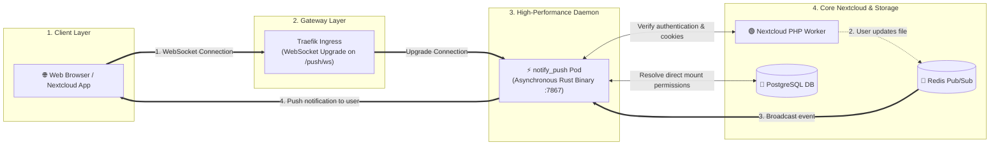

# High-Performance Files Backend (Notify Push) Architecture

This document explains the architectural design, event pipeline, and performance advantages of the **High-Performance Files Backend (`notify_push`)** in the Nextcloud enterprise stack.

---

## 1. The Core Problem: Polling vs Persistent WebSockets

In standard Nextcloud deployments without Notify Push:
* Every active browser tab, desktop client, and mobile app sends HTTP requests (`PROPFIND` / `GET`) every **30 seconds**.
* 100 users with multiple tabs open generate **thousands of PHP-FPM processes per minute** just to check if anything changed.
* This causes high CPU usage, database connection starvation, and sluggish server responsiveness.

```mermaid
graph TD
    subgraph Traditional_Polling["❌ Traditional AJAX Polling (Heavy Load)"]
        Client1[Browser Tab] -->|Every 30s HTTP Request| Web1[PHP-FPM Worker]
        Web1 -->|Query DB| DB1[(PostgreSQL)]
        Web1 -->|Return 'No Change'| Client1
    end

    subgraph Notify_Push_Model["✅ Notify Push Event-Driven (Zero Overhead)"]
        Client2[Browser Tab] ===>|Persistent WebSocket (Idle)| Daemon[notify_push Rust Daemon]
        PHP[PHP App] -.->|File Modified| Redis[("Redis Pub/Sub")]
        Redis ===>|Instant Push| Daemon
        Daemon ===>|Instant Event Delivery| Client2
    end
```

---

## 2. Event Streaming Architecture



---

## 3. Key Architectural Benefits

1. **Over 90% Reduction in PHP Server Load:** WebSockets remain completely idle until an actual event occurs, freeing PHP workers for real file transfers and API requests.
2. **Sub-Millisecond Synchronization:** Instant file update badges and real-time collaboration signals across all connected devices.
3. **Massive Scalability:** The compiled Rust binary uses asynchronous epoll/kqueue I/O, allowing a single lightweight container to maintain **10,000+ active connections on < 50MB RAM**.
