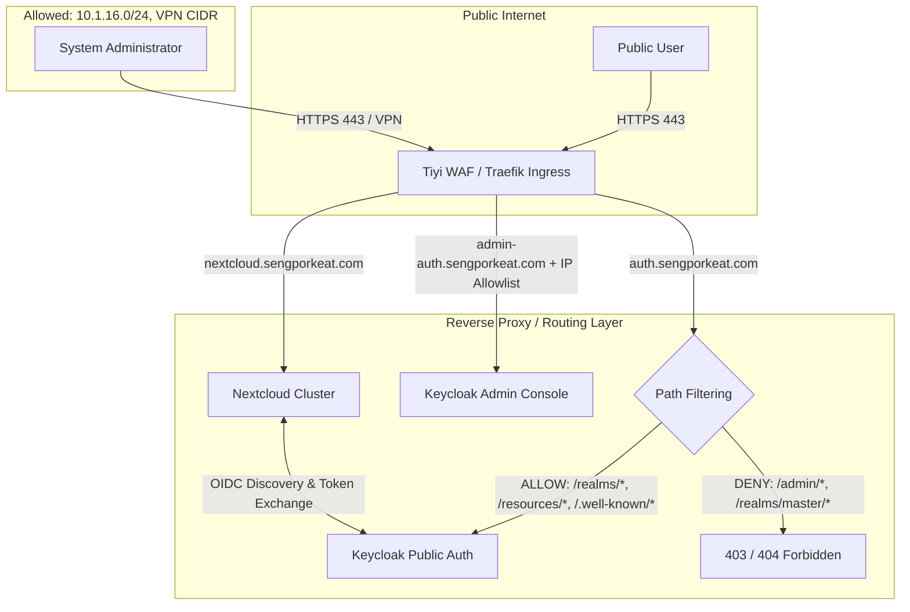

# 8. Enterprise Keycloak SSO Architecture & Security Hardening

This guide outlines the production architecture for deploying Keycloak alongside Nextcloud, enforcing **split-horizon access (Public SSO vs. VPN/Office-Only Admin Console)**, Traefik path filtering, and trusted proxy controls.

---

## 1. High-Level Architecture Topology



---

## 2. Keycloak Dual-Hostname Configuration

Keycloak should be configured with a fixed hostname architecture rather than dynamically resolving hostnames from client headers.

### Environment Variables (`KC_HOSTNAME` & `KC_HOSTNAME_ADMIN`)
```yaml
environment:
  # Public endpoint for user authentication & Nextcloud OIDC
  KC_HOSTNAME: https://auth.sengporkeat.com
  
  # Private endpoint strictly for admin console
  KC_HOSTNAME_ADMIN: https://admin-auth.sengporkeat.com
  
  # Proxy configuration
  KC_PROXY_HEADERS: xforwarded
  KC_PROXY_TRUSTED_ADDRESSES: 10.1.18.0/24,10.1.16.0/24,10.233.0.0/18
  
  # Production HTTP settings
  KC_HTTP_ENABLED: "true"
  KC_HTTP_PORT: "8080"
```

> [!IMPORTANT]
> Setting `KC_HOSTNAME_ADMIN` tells Keycloak what URLs to generate, but **does not by itself block administrative endpoints on the public domain**. The Reverse Proxy / Traefik Ingress MUST enforce the firewall and path rules.

---

## 3. Traefik IngressRoute & Path Filtering

### A. Public Authentication Route (`auth.sengporkeat.com`)
Strictly allow only the required OIDC endpoints and block administrative paths:

```yaml
apiVersion: traefik.io/v1alpha1
kind: IngressRoute
metadata:
  name: keycloak-public-route
  namespace: keycloak-system
spec:
  entryPoints:
  - web
  - websecure
  routes:
  - kind: Rule
    match: Host(`auth.sengporkeat.com`) && (PathPrefix(`/realms/`) || PathPrefix(`/resources/`) || PathPrefix(`/.well-known/`)) && !PathPrefix(`/realms/master/`)
    services:
    - name: keycloak-service
      port: 8080
    middlewares:
    - name: nextcloud-security-headers
      namespace: nextcloud-system
```

---

### B. Private Admin Route with IP Allowlist (`admin-auth.sengporkeat.com`)
Create a Traefik IP Allowlist middleware to permit only office and VPN subnets:

```yaml
apiVersion: traefik.io/v1alpha1
kind: Middleware
metadata:
  name: keycloak-admin-ip-allowlist
  namespace: keycloak-system
spec:
  ipAllowList:
    sourceRange:
    - 10.1.16.0/24     # Internal Office / Node Subnet
    - 10.20.0.0/24     # VPN Client CIDR
    - 10.1.18.0/24     # WAF Internal Subnet
---
apiVersion: traefik.io/v1alpha1
kind: IngressRoute
metadata:
  name: keycloak-admin-route
  namespace: keycloak-system
spec:
  entryPoints:
  - web
  - websecure
  routes:
  - kind: Rule
    match: Host(`admin-auth.sengporkeat.com`)
    middlewares:
    - name: keycloak-admin-ip-allowlist
      namespace: keycloak-system
    - name: nextcloud-security-headers
      namespace: nextcloud-system
    services:
    - name: keycloak-service
      port: 8080
```

---

## 4. Reverse Proxy Header Overwriting & Forwarding

Do not blindly trust client-supplied headers. The reverse proxy must overwrite them:

| Header | Purpose | Proxy Policy |
| :--- | :--- | :--- |
| `X-Forwarded-For` | Client public IP | Appended by WAF / Traefik (`$proxy_add_x_forwarded_for`) |
| `X-Forwarded-Proto` | Request protocol (`https`) | Overwritten to `$scheme` / `https` |
| `X-Forwarded-Host` | Host header (`auth.sengporkeat.com`) | Overwritten to `$host` |
| `X-Forwarded-Port` | Port (`443`) | Overwritten to `$server_port` |

---

## 5. Security Defense in Depth Summary

| Defense Layer | Control Mechanism | Implementation |
| :--- | :--- | :--- |
| **Layer 1: Network** | Firewall isolation | Keycloak port `8080` is internal-only; no direct internet exposure. |
| **Layer 2: WAF / Traefik** | Split domain & path filter | `auth.sengporkeat.com` exposes only `/realms/*`; `/admin/*` is blocked. |
| **Layer 3: Ingress Allowlist** | VPN / Office restriction | `admin-auth.sengporkeat.com` is locked to VPN/Office CIDRs. |
| **Layer 4: Keycloak App** | OIDC Realm & Admin MFA | Dedicated realm for Nextcloud; MFA enforced on master realm. |
| **Layer 5: Nextcloud** | `user_oidc` & `trusted_proxies` | PKCE authentication; client IP extracted from trusted proxies. |
