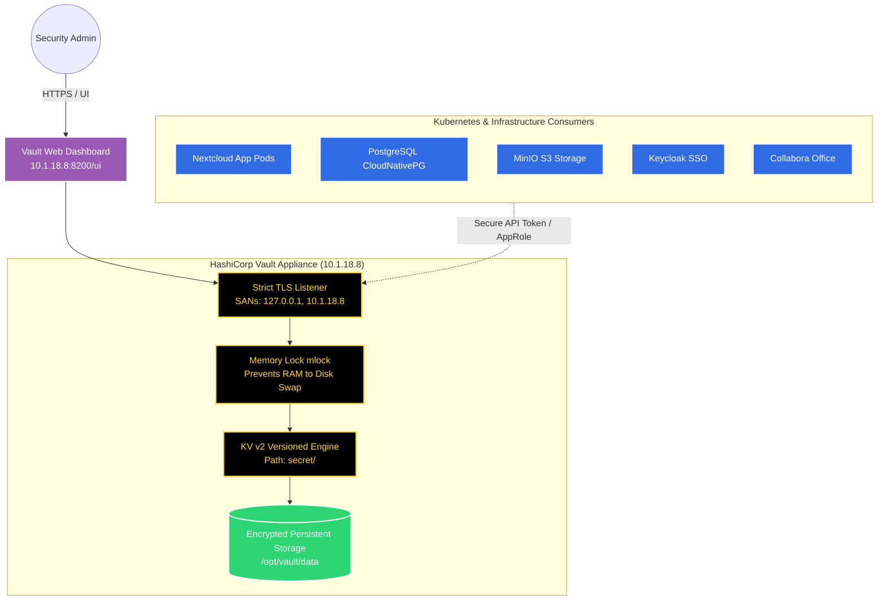

# 11. HashiCorp Vault Enterprise Secrets Architecture

This document details the centralized secrets management architecture using **HashiCorp Vault v2.0.4** running on a dedicated security appliance at `10.1.18.8:8200`.

---

## 🏗️ Architecture Blueprint

---

## 🔒 Security Principles & Hardening

1. **Strict Cryptographic TLS with SANs:**
   * Built on an internal Root CA (`/opt/vault/tls/vault-ca.crt`).
   * Certified with explicit Subject Alternative Names: `127.0.0.1`, `10.1.18.8`, `localhost`, `vault.local`.
   * Enforces `tls_min_version = "tls12"`.

2. **RAM Anti-Scraping (`mlock` Memory Protection):**
   * Uses Linux `CAP_IPC_LOCK` to lock memory pages containing unsealed master encryption keys in RAM.
   * Cryptographic keys are **never swapped to physical SSD storage**, mitigating physical memory extraction threats.

3. **Shamir's Secret Sharing Threshold:**
   * Unseal Key Shares: **5**
   * Unseal Key Threshold: **3**
   * Requires 3 separate keyholders to reconstruct the master key and unseal Vault into RAM.

4. **Zero-Trust File Permissions:**
   * `/opt/vault/data` locked to `700 vault:vault`.
   * `/opt/vault/tls/*.key` locked to `600 vault:vault`.

---

## 📋 Hierarchical Secret Taxonomy (`secret/`)

All infrastructure credentials are categorized into versioned Key-Value v2 paths:

| Path | Keys Stored | Purpose |
| :--- | :--- | :--- |
| **`secret/nextcloud`** | `db_user`, `db_password`, `minio_access_key`, `minio_secret_key`, `admin_user`, `admin_password` | Core Nextcloud application, database, and S3 credentials |
| **`secret/collabora`** | `admin_user`, `admin_password` | Collabora Online Office admin credentials |
| **`secret/backups`** | `minio_endpoint`, `minio_admin_user`, `minio_admin_password`, `velero_bucket`, `db_backup_bucket`, `db_dump_password` | Master S3 backup infrastructure & Velero access |
| **`secret/keycloak`** | `admin_user`, `realm`, `client_id` | Single Sign-On (SSO) OAuth2/OIDC configurations |
| **`secret/infrastructure`** | `node1_ip`, `node2_ip`, `node3_ip`, `minio_ip`, `vault_ip` | Physical cluster IP topology and host metadata |
