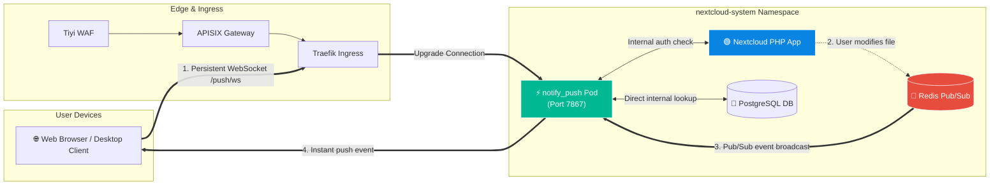

# Nextcloud High-Performance Files Backend (`notify_push`) Setup & Tuning Guide

This document details the configuration, deployment architecture, and performance tuning for **Nextcloud Notify Push** (also known as the High-Performance Backend / HPB).

---

## 1. What is `notify_push` and Why Does It Matter?

By default, every open Nextcloud web tab or mobile app polls the server every **30 seconds** via HTTP AJAX requests to check if files or notifications have changed. With 50–100 active users, this generates thousands of unnecessary PHP-FPM requests per minute, consuming massive CPU, memory, and database connections.

**Notify Push** replaces polling with a lightweight, multi-threaded **Rust WebSocket Daemon**:
* **90%+ Reduction in PHP Server Load:** Browsers maintain an idle WebSocket connection instead of spamming HTTP requests.
* **Instant Sub-Millisecond Sync:** File modifications, chat messages, and desktop client notifications are pushed to users in real time.
* **Extreme Concurrency:** A single `notify_push` pod can easily handle **10,000+ simultaneous WebSocket connections** using under 50 MB of RAM.

---

## 2. Architecture & Data Flow



---

## 3. Kubernetes Deployment & Service Manifests

The full manifest is available at [`manifests/20-notify-push-deployment.yaml`](../manifests/20-notify-push-deployment.yaml).

### Environment Variables Breakdown

| Variable | Recommended Setting | Description |
| :--- | :--- | :--- |
| `NEXTCLOUD_URL` | `http://nextcloud-service:8080` | Internal Nextcloud service endpoint for cookie & auth validation. |
| `DATABASE_URL` | `postgres://admin:<URL_ENCODED_PW>@nextcloud-db-rw:5432/nextcloud` | Direct PostgreSQL connection for instant file permission resolution. |
| `REDIS_URL` | `redis://:<URL_ENCODED_PW>@nextcloud-redis-node-1.nextcloud-redis-headless:6379` | Direct Redis instance for sub-millisecond Pub/Sub event streaming. |
| `NEXTCLOUD_CONFIG_DIR` | `/var/www/html/config` | Path to mounted Nextcloud config volume. |

> [!IMPORTANT]
> **Special Characters in Passwords:**
> If your database or Redis password contains characters like `#`, `@`, `!`, or `$`, you **must URL-encode them** in `DATABASE_URL` and `REDIS_URL` (e.g. `#` ➡️ `%23`, `@` ➡️ `%40`, `!` ➡️ `%21`).

---

## 4. Gateway Ingress Configuration (Traefik & APISIX)

WebSocket connections require explicit HTTP header forwarding (`Upgrade` and `Connection`).

### Traefik Route Rule:
```yaml
- match: Host(`nextcloud.sengporkeat.com`) && PathPrefix(`/push`)
  kind: Rule
  services:
  - name: nextcloud-notify-push
    port: 7867
```

### APISIX Proxy Settings:
Ensure APISIX allows WebSocket upgrades and has long timeout thresholds to prevent dropped connections:
* `proxy_read_timeout: 3600s`
* `proxy_send_timeout: 3600s`
* `enable_websocket: true`

---

## 5. Performance Tuning & High-Scale Optimizations

### 1. Redis Pub/Sub Latency Optimization
Always point `REDIS_URL` to the **Redis Master pod** (port 6379) rather than Sentinel (port 26379). Redis Pub/Sub operates in memory without persistence overhead, delivering events in `< 1ms`.

### 2. High-Concurrency Kernel & Resource Limits
For enterprise deployments supporting >1,000 concurrent desktop/mobile sync clients:

```yaml
resources:
  requests:
    cpu: 100m
    memory: 64Mi
  limits:
    cpu: 1000m
    memory: 512Mi
```

### 3. Database Connection Pooling
`notify_push` maintains an internal asynchronous connection pool to PostgreSQL. Because it performs simple read-only metadata lookups, keep the pool size between 5–15 connections to avoid starving Nextcloud PHP workers.

---

## 6. Operational Verification & Diagnostics

Run these commands inside your Nextcloud container to verify health and view live metrics:

### 1. Run Automated Self-Test
```bash
kubectl exec -n nextcloud-system deployment/nextcloud -- su -s /bin/bash www-data -c 'php occ notify_push:self-test'
```
**Expected Output:**
```text
✓ redis is configured
✓ push server is receiving redis messages
✓ push server can load mount info from database
✓ push server can connect to the Nextcloud server
✓ push server is a trusted proxy
✓ push server is running the same version as the app
```

### 2. View Real-Time WebSocket Metrics
```bash
kubectl exec -n nextcloud-system deployment/nextcloud -- su -s /bin/bash www-data -c 'php occ notify_push:metrics'
```
*(Displays active WebSocket connections, message throughput, and Redis queue health).*

### 3. Tail Push Daemon Logs
```bash
kubectl logs -f -n nextcloud-system deployment/nextcloud-notify-push
```
